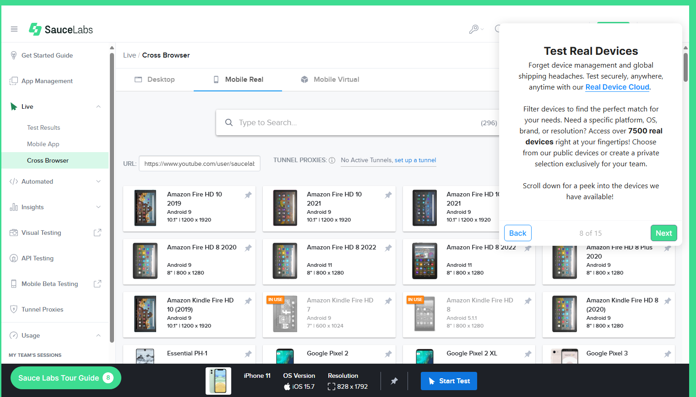

# Sauce Labs

## Summary  
Sauce Labs is a cloud‑based platform for automated and manual testing across web browsers, operating systems, and real mobile devices. It provides an infrastructure for running tests at scale without maintaining on‑premise hardware, enabling engineering teams to focus on quality and delivery rather than test environment management.

The platform supports modern frameworks such as Selenium, Playwright, Cypress, Appium, and WebdriverIO, making it suitable for teams working with a wide range of technology stacks. Sauce Labs also offers analytics, visual testing, CI/CD integrations and AI‑driven agents that accelerate test creation, debugging and insights.

---

## Capabilities Overview  
**Cross‑browser and cross‑device testing**  
- Run tests on thousands of real browser/OS combinations.  
- Support for Windows, macOS, iOS, and Android.  
- Access to both emulators/simulators and real device clouds.

- 

**Automation framework support**  
- Compatible with Selenium, Playwright, Cypress, WebdriverIO, Appium, and Espresso.  
- Remote WebDriver (or equivalent) execution via the Sauce cloud.  
- Secure tunnel (Sauce Connect) for testing behind corporate firewalls.

**Visual and functional testing**  
- Automated capture of screenshots, videos, and logs for each session.  
- Visual regression testing to detect unintended UI changes.  
- Performance metrics (load times, responsiveness) available for front‑end apps.

**CI/CD integration**  
- Native plugins/APIs for Jenkins, GitHub Actions, GitLab CI, CircleCI, Azure DevOps.  
- Parallel execution to reduce test feedback time in build pipelines.  
- Reporting and defect‑tracking integration (Jira/TestRail etc.).

**Analytics and insights**  
- Unified dashboards to review session details, logs, error history and trends.  
- AI‑assisted analysis to highlight flaky tests, common failure patterns and risk areas.  
- Natural language interface: ask questions in plain English to uncover insights without manual querying.

**Security and compliance**  
- Enterprise‑grade security (SOC 2 Type II, GDPR, ISO 27001 compliance).  
- Secure tunnelling for internal application testing environments.  
- Configurable data retention and user access controls.

**AI‑native capabilities**  
- *Sauce AI Agents* automate key testing tasks:  
  - **Authoring**: From wireframes or user stories to reusable test suites in minutes - enabling broader coverage with less manual effort.
  - **Insights**: Natural‑language queries over build/test data to instantly surface issues, flaky patterns and risk.
  - **Debugging/Error Reporting**: AI‑driven analysis of runtime and crash/error data, surfacing root causes and patterns proactively.

---

## Typical Use Cases  
- **Cross‑browser regression testing**: Run automated UI suites across a full matrix of browsers just prior to release.  
- **Mobile compatibility validation**: Use the real‑device cloud to validate mobile web views or native app behaviour across iOS/Android.  
- **Exploratory/live sessions**: Launch interactive sessions on specific browsers/devices for manual exploratory testing.  
- **Continuous integration testing**: Embed parallelised test execution into CI/CD pipelines (monthly release/frequent sprint cycle) for quicker feedback.  
- **Client‑facing quality reporting**: Share session recordings, screenshots and analytics with stakeholders to demonstrate quality assurance.  
- **AI‑driven test creation & maintenance**: Use Sauce AI Agents to author new test cases from user stories or wireframes, reduce maintenance overhead and expand test coverage.  
- **Intelligent failure triage & root‑cause analysis**: Use AI insights to interrogate test/build data, find latent issues, and prioritise debug work.

---

## Pros  
- **Extensive browser/device coverage**: no need to self‑host large device farms or browser grids.  
- **High scalability**: parallel execution across devices shortens test feedback loops.  
- **Broad ecosystem integration**: supports most modern frameworks and CI tools.  
- **Rich reporting/debugging features**: video, logs, screenshots, analytics make root‑cause easier.  
- **Enterprise‑grade security**: suitable for clients with compliance and data‑governance demands.  
- **AI‑native augmentation**: test generation, analytics, debugging accelerated by the Sauce AI Agents.

---

## Cons and Limitations  
- **Cost at scale** — high concurrency, many sessions or real devices can lead to significant cost.  
- **Network/tunnel dependency**: private networks or high latency environments may degrade performance.  
- **Limited infrastructure control**: you rely on Sauce Labs to maintain browsers/devices; bespoke or uncommon configurations may be unsupported.  
- **Potential for flakiness**: shared cloud infrastructure and network variability may produce intermittent failures that require careful test architecture.  
- **Setup/learning curve**: configuring secure tunnels, CI integration, parallel execution and AI features may take time.  
- **AI features maturity**: while powerful, the AI‑agents are a newer offering; for highly advanced visual‑AI or niche frameworks there may still be best‑in‑class specialised tools.

---

## Pricing Snapshot  
Sauce Labs pricing is subscription‑based, typically determined by:  
- **Concurrency level**: number of simultaneous sessions allowed.  
- **Device type**: real device vs virtual/emulator.  
- **Data retention**: storage duration for artifacts (videos, logs, screenshots).  
- **Support/SLA level**: standard vs premium enterprise support.  
A free trial is available; enterprise pricing is customised based on usage and team size. For up‑to‑date details see [Sauce Labs pricing page](https://saucelabs.com/pricing).

---

## Recommendation  

### Recommended For  
- Teams needing **broad cross‑browser or device coverage** without investing in large infrastructure.  
- Consultancies or QA organisations supporting **multiple client engagements** where each may demand different browsers/devices.  
- Agile teams working in **CI/CD pipelines** with fast feedback loops and frequent releases.  
- Automation engineers using **Selenium, Playwright, Appium** frameworks ready to scale.  
- Projects where **security/compliance**, data governance and corporate‑grade cloud platforms are required.  
- Organisations wanting to leverage **AI‑driven test generation and insights** to boost quality and reduce manual effort.

### Use Caution If  
- Your **testing budget is limited** and you expect very high session volumes or concurrency requirements.  
- You need **ultra‑low latency or on‑premise testing** (e.g., air‑gapped networks or restricted environments) where cloud access is constrained.  
- Your tests involve **highly sensitive or proprietary data** that must remain entirely on‑premises or isolated.  
- You need **fine‑grained control over every device/browser version** or are working with very specialised hardware/firmware.  
- Your primary requirement is **high‑specialty visual AI regression or niche frameworks** where dedicated tools may outperform the general‑purpose cloud platform.

---

